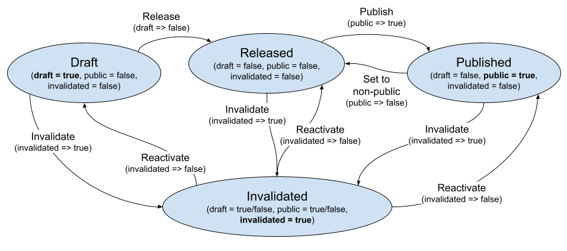

# dataset-service

It is a backend service providing a REST API to manage datasets.
The API is described in detail using OpenAPI v3 specification standard format in the file `api-docs/API-reference-v1.yaml` 
(rendered by Redoc here: https://chaimeleon-eu.i3m.upv.es/dataset-service/api-doc).

Some operations require authentication using the OpenId-Connect standard protocol. 
Basically, when the user wants to login, the client application must redirect to the authentication service, to obtain a bearer token. 
Then, that token must be included in the "Authorization" header of any request sent to the dataset-service. More details below.

Basic API operations:
 - POST /api/datasets
 - GET /api/datasets/{id}
 - PATCH /api/datasets/{id}
 - GET /api/datasets

Below there is a walkthrough by examples with CURL.

Other managed routes outside /api/:
 - GET /web/{staticFilePath}   
   static files needed to load the client app (frontend) in the browser
 - GET /{anyOtherPath}      
   internally redirected to /web/index.html, the client app with JS code that manages locally other routes like /datasets 

## API Usage

```
DSS_ENDPOINT=https://chaimeleon-eu.i3m.upv.es/dataset-service/api
```

### Authentication to obtain a bearer token

Some operations require previous authentication using the OpenId-Connect standard protocol.
It is recommended to use an OpenID-Connect library for the programming language of your client application, 
it will ease your work providing things like the automatic refresh of the token. 
You can use a generic library or a particular library for the implementation used in your project. 
For example, if Keycloak is used, you can use the "client adapter": https://www.keycloak.org/docs/latest/securing_apps/#supported-platforms

If you use React: https://www.npmjs.com/package/@react-keycloak/web

Basically the user will be redirected to the authentication service with a URL like this: 
https://chaimeleon-eu.i3m.upv.es/auth/realms/CHAIMELEON/protocol/openid-connect/auth/?scope=openid+email+profile&response_type=id_token&client_id=dataset-service-ui&redirect_uri=https://chaimeleon-eu.i3m.upv.es/dataset-service/

The last parameter ("redirect_uri") contains the URI of our client application.
When the user comes back to our client application, the bearer token will be included in the URL as a parameter named 'id_token'.

For development/testing purposes you can use curl to obtain a token:
```
echo 'Write <yourUserName> <yourPassword>' && read DSS_USER DSS_PASS
```
```
DSS_TOKEN=$(curl -d "client_id=dataset-explorer" -d "username=$DSS_USER" -d "password=$DSS_PASS" -d "grant_type=password" \
                 "https://chaimeleon-eu.i3m.upv.es/auth/realms/CHAIMELEON/protocol/openid-connect/token" | jq -r ".access_token")
```
Warning: please ensure you are using "https" in the URL to avoid send password in clear text.

Once the token has been obtained it must be included in a header like this:
`Authorization: bearer <token>`

The <token> is the JWT (JSON Web Token) provided by the authorization service that will be verified (sign, expiration time, etc.) by the dataset-service. 
Also the user data will be extracted from the token in order to set the author of the dataset (in case of creation) and the author of the operation to 
send to the tracer service.

### Creation of a dataset

POST /datasets

With the authorization header and the dataset properties within the body in JSON format. 
If success, the code 201 will be returned. 
If fail, a 40X code will be returned with a JSON object in the body containing also the code and the error message.

Details: https://chaimeleon-eu.i3m.upv.es/dataset-service/api-doc#tag/datasets/operation/createDataset

Example:
```
$ curl -i -X POST \
       -H "Authorization: bearer $DSS_TOKEN" \
       -H "Content-Type: application/json" \
       -d '{"name": "TestDataset3", "description": "This is a dataset for testing.", "studies": [{     "studyId": "5e57a4356af19d299c17026d",     "studyName": "GMIBG2DECUERPOENTERO",     "subjectName": "17B76FEW",     "pathInDatalake": "blancagomez/17B76FEW_Neuroblastoma/GMIBG2DECUERPOENTERO20160225",   "series": [{"folderName": "serie1", "tags":[]}, {"folderName": "serie2", "tags":[]}, {"folderName": "serie3", "tags":[]}],    "url": ""   },   {     "studyId": "5e5629835938d32160636353",     "studyName": "RM431RMRENAL",     "subjectName": "17B76FEW",     "pathInDatalake": "blancagomez/17B76FEW_Neuroblastoma/RM431RMRENAL20130820",    "series": [{"folderName": "serie1", "tags":[]}],   "url": ""   },   {     "studyId": "5e6a422939b892367c8a5c23",     "studyName": "TCPEDITRICOABDOMINOPLVICOCONCONTRASTE",     "subjectName": "17B76FEW",     "pathInDatalake": "blancagomez/17B76FEW_Neuroblastoma/TCPEDITRICOABDOMINOPLVICOCONCONTRASTE20150129",   "series": [{"folderName": "serie1", "tags":[]}],    "url": ""   },   {     "studyId": "5e6b449a3144dc2bc0841efc",     "studyName": "RM411RMABDOMEN",     "subjectName": "21N56F7T",     "pathInDatalake": "blancagomez/21N56F7T_Neuroblastoma/RM411RMABDOMEN20100804",    "series": [{"folderName": "serie1", "tags":[]}],   "url": ""   },   {     "studyId": "5e6a3d41c9065c475c32b3fe",     "studyName": "RM411RMABDOMEN",     "subjectName": "21N56F7T",     "pathInDatalake": "blancagomez/21N56F7T_Neuroblastoma/RM411RMABDOMEN20150109",   "series": [{"folderName": "serie1", "tags":[]}],    "url": ""   },   {     "studyId": "5eeba960903aec091076c180",     "studyName": "RM815RMDORSAL",     "subjectName": "1GB90F75",     "pathInDatalake": "blancagomez/1GB90F75_Neuroblastoma/RM815RMDORSAL20121123",    "series": [{"folderName": "serie1", "tags":[]}],   "url": ""   }], "subjects": [{"subjectName": "17B76FEW", "eForm": {}}, {"subjectName": "21N56F7T", "eForm": {}}, {"subjectName": "1GB90F75", "eForm": {}}]}' \
       "${DSS_ENDPOINT}/datasets"

HTTP/1.1 100 Continue

HTTP/1.1 201 Created
Content-Length: 61
Content-Type: application/json

{"url": "/api/datasets/efa2cba6-4a17-4612-8074-7e9eb9c9d7ca"}
```

Example of "external" dataset creation:
```
$ curl -i -X POST \
       -H "Authorization: bearer $DSS_TOKEN" \
       -F name="Maastricht Lung1" -F description="Test dataset from Maastricht University." \
       -F clinical_data=@"NSCLC Radiomics Lung1.clinical.csv" \
       "${DSS_ENDPOINT}/datasets?external=True"

HTTP/1.1 100 Continue

HTTP/1.1 201 Created
Content-Length: 61
Content-Type: application/json

{"url": "/api/datasets/3388a9c5-4ebb-45ba-93fc-7b54813f0cf2"}
```

The creation of a medium or big dataset can be a time consuming process, so it is asynchronous.
The POST operation returns the code 201 after some checks over the input and the creation of the dataset in database.
The rest of work (file system setup and hash calculation) is done by a kubernetes job 
and the progress can be retrieved with GET /datasets/{id}/creationStatus.
While the dataset is being created the flag "draft" is true and can not be changed to false (it does not appear in the "dataset.editablePropertiesByTheUser").
When the flag "draft" is true, there is another flag "creating" which is true until the end of the creation process (i.e. while the retrieving of creationStatus makes sense).

### List of all datasets

GET /datasets

With the authorization header and some parameters accepted in the URL for pagination. 
If success, the code 200 will be returned and a JSON array in the body of the response. 
If fail, a 40X code will be returned with a JSON object in the body containing also the code and the error message.

Details: https://chaimeleon-eu.i3m.upv.es/dataset-service/api-doc#tag/datasets/operation/listDatasets

Example:
```
$ curl -i -X GET \
       -H "Authorization: bearer $DSS_TOKEN" \
       "${DSS_ENDPOINT}/datasets?limit=30&skip=0"
HTTP/1.1 200 OK
Content-Type: application/json
Content-Length: 728

[{"id": "f99017af-9015-4222-b064-77f3c1b49d8b", "name": "TestDataset3", "authorName": "test test", "creationDate": "2021-10-05 12:29:11.932542", "public": false, "invalidated": false, "studiesCount": 6, "subjectsCount": 3}, 
 {"id": "00e821c4-e92b-48f7-a034-ba2df547e2bf", "name": "TestDataset2", "authorName": "test test", "creationDate": "2021-10-04 14:50:47.214108", "public": false, "invalidated": false, "studiesCount": 1, "subjectsCount": 1}, 
 {"id": "efa2cba6-4a17-4612-8074-7e9eb9c9d7ca", "name": "TestDataset1", "authorName": "test test", "creationDate": "2021-10-04 14:42:37.725548", "public": false, "invalidated": false, "studiesCount": 1, "subjectsCount": 1}]
```

### Search of datasets by name

This is the same operation as the previous example but with the parameter `searchString` (case-insensitive). 

Details: https://chaimeleon-eu.i3m.upv.es/dataset-service/api-doc#tag/datasets/operation/listDatasets

Example:
```
$ curl -i -X GET \
       -H "Authorization: bearer $DSS_TOKEN" \
       "${DSS_ENDPOINT}/datasets?searchString=dataset3"
HTTP/1.1 200 OK
Content-Type: application/json
Content-Length: 182

[{"id": "f99017af-9015-4222-b064-77f3c1b49d8b", "name": "TestDataset3", "authorName": "test test", "creationDate": "2021-10-05 12:29:11.932542", "public": false, "invalidated": false, "studiesCount": 6, "subjectsCount": 3}]
```

### Get details of a dataset by its id

GET /datasets/{id}

With the authorization header and some parameters accepted in the URL for pagination of studies in the dataset. 
Returns a JSON object. 
If fail, a 40X code will be returned with a JSON object in the body containing also the code and the error message.

Details: https://chaimeleon-eu.i3m.upv.es/dataset-service/api-doc#tag/datasets/operation/getDataset

Example:
```
$ curl -i -X GET \
       -H "Authorization: bearer $DSS_TOKEN" \
       "${DSS_ENDPOINT}/datasets/f99017af-9015-4222-b064-77f3c1b49d8b?studiesLimit=30"
HTTP/1.1 200 OK
Content-Type: application/json
Content-Length: 1506

{"id": "f99017af-9015-4222-b064-77f3c1b49d8b", "name": "TestDataset3", "previousId": null, "authorId": "a43d426c-11aa-41cb-ab15-616d68627c77", "authorName": "test test", "authorEmail": "test@upv.es", "creationDate": "2021-10-05 22:29:11.932542", "description": "This is a dataset for testing.", "gid": 1, "public": false, "studiesCount": 6, "subjectsCount": 3, 
"studies": [
    {"studyId": "5e57a4356af19d299c17026d", "studyName": "GMIBG2DECUERPOENTERO", "subjectName": "17B76FEW", "url": ""}, 
    {"studyId": "5e5629835938d32160636353", "studyName": "RM431RMRENAL", "subjectName": "17B76FEW", "url": ""}, 
    {"studyId": "5e6a422939b892367c8a5c23", "studyName": "TCPEDITRICOABDOMINOPLVICOCONCONTRASTE", "subjectName": "17B76FEW", "url": ""}, 
    {"studyId": "5e6b449a3144dc2bc0841efc", "studyName": "RM411RMABDOMEN", "subjectName": "21N56F7T", "url": ""}, 
    {"studyId": "5e6a3d41c9065c475c32b3fe", "studyName": "RM411RMABDOMEN", "subjectName": "21N56F7T", "url": ""}, 
    {"studyId": "5eeba960903aec091076c180", "studyName": "RM815RMDORSAL", "subjectName": "1GB90F75", "url": ""}
]}
```

### Invalidate a dataset by its id

PATCH /datasets/{id}

With the authorization header. 
If success, the code 200 will be returned. 
If fail, a 40X code will be returned with a JSON object in the body containing also the code and the error message.

Details: https://chaimeleon-eu.i3m.upv.es/dataset-service/api-doc#tag/datasets/operation/modifyDataset

Example:
```
$ curl -i -X PATCH \
       -H "Authorization: bearer $DSS_TOKEN" \
       -H "Content-Type: application/json" \
       -d '{"property": "public", "value": true}' \
       "${DSS_ENDPOINT}/datasets/00e821c4-e92b-48f7-a034-ba2df547e2bf"
HTTP/1.1 200 OK
Content-Length: 0
Content-Type: text/html; charset=UTF-8
```

### List projects

Example:
```
# curl -i -X GET \
       -H "Authorization: bearer $DSS_TOKEN" \
       "${DSS_ENDPOINT}/projects?purpose=projectList"
HTTP/2 200
content-type: application/json
content-length: 50

[{"code": "CHAIMELEON", "name": "Accelerating the lab to market transition of AI tools for cancer management", "logoUrl": ""}]
```

### Get details of a project

Example:
```
$ curl -i -X GET \
       -H "Authorization: bearer $DSS_TOKEN" \
       "${DSS_ENDPOINT}/projects/CHAIMELEON"
HTTP/2 200
content-type: application/json
content-length: 297

{"code": "CHAIMELEON", 
 "name": "Accelerating the lab to market transition of AI tools for cancer management", 
 "shortDescription": "...", 
 "externalUrl": "", 
 "logoUrl": "", 
 "editablePropertiesByTheUser": ["name", "shortDescription", "externalUrl", "logoUrl"], 
 "allowedActionsForTheUser": ["config"]}
```

### Create a user

PUT /users/{userName}

With the authorization header and the user properties within the body in JSON format. 
If success, the code 201 will be returned. 
If fail, a 40X code will be returned with a JSON object in the body containing also the code and the error message.

Details: https://chaimeleon-eu.i3m.upv.es/dataset-service/api-doc#tag/users/operation/createUser

Example authenticating previously with a service account:
```
$ DSS_TOKEN=$(curl -d "client_id=kubeauthorizer-pod" -d "client_secret=XXXX-XXXX-XXXX" -d "grant_type=client_credentials" \
                   "https://chaimeleon-eu.i3m.upv.es/auth/realms/CHAIMELEON/protocol/openid-connect/token" | jq -r ".access_token")
```
```
$ curl -i -X PUT -H "Authorization: bearer $DSS_TOKEN" -H "Content-Type: application/json" \
       -d '{"uid": "d290f1ee-6c54-4b01-90e6-d701748f0851", "groups": ["data-scientists", "dataset-administrator"]}' \
       "${DSS_ENDPOINT}/users/user1"
HTTP/1.1 201 Created
Content-Length: 0
Content-Type: text/html; charset=UTF-8
```

### Get the user GID

GET /users/{userName}

With the authorization header. 
Returns a JSON object. 
If fail, a 40X code will be returned with a JSON object in the body containing also the code and the error message.

Details: https://chaimeleon-eu.i3m.upv.es/dataset-service/api-doc#tag/users/operation/getUser

Example:
```
$ curl -i -X GET -H "Authorization: bearer $DSS_TOKEN" "${DSS_ENDPOINT}/users/user1"
HTTP/1.1 200 OK
Content-Type: application/json
Content-Length: 13

{"gid": 2002}
```

### Check dataset access

POST /datasetAccessCheck

With the authorization header and the access properties (userName and datasets required) within the body in JSON format. 
If success, the code 204 will be returned. 
If fail, a 40X code will be returned with a JSON object in the body containing also the code and the error message.
In case of fail due to any required dataset which is not available for the user, the code 403 is returned with a JSON array containing not available datasets.

Details: https://chaimeleon-eu.i3m.upv.es/dataset-service/api-doc#tag/datasetAccesses/operation/checkDatasetAccess

Example authenticating previously with a service account:
```
$ DSS_TOKEN=$(curl -d "client_id=kubernetes-operator" -d "client_secret=XXXX-XXXX-XXXX" -d "grant_type=client_credentials" \
                   "https://chaimeleon-eu.i3m.upv.es/auth/realms/CHAIMELEON/protocol/openid-connect/token" | jq -r ".access_token")
```
```
$ curl -i -X POST -H "Authorization: bearer $DSS_TOKEN" -H "Content-Type: application/json" \
       -d '{"userName": "user1", "datasets": ["00e821c4-e92b-48f7-a034-ba2df547e2bf", "f99017af-9015-4222-b064-77f3c1b49d8b"]}' \
       "${DSS_ENDPOINT}/datasetAccessCheck"
HTTP/1.1 204 No Content
Content-Length: 0
```

### Create dataset access

POST /datasetAccess/{id}

With the authorization header and the access properties (userName, datasets required and tool info) within the body in JSON format. 
If success, the code 201 will be returned. 
If fail, a 40X code will be returned with a JSON object in the body containing also the code and the error message.
In case of fail due to any required dataset which is not available for the user, the code 403 is returned.

Details: https://chaimeleon-eu.i3m.upv.es/dataset-service/api-doc#tag/datasetAccesses/operation/createDatasetAccess

Example:
```
$ curl -i -X POST -H "Authorization: bearer $DSS_TOKEN" -H "Content-Type: application/json" \
       -d '{"userName": "user1", "datasets": ["f99017af-9015-4222-b064-77f3c1b49d8b"], "toolName": "desktop-tensorflow", "toolVersion": "0.3.1"}' \
       "${DSS_ENDPOINT}/datasetAccess/c0bd6506-219b-4fc2-8fdb-3deb1d1a4ac2"
HTTP/1.1 201 Created
Content-Length: 0
```

### [Only for developers] Set or update the web UI

POST /set-ui

To set the web UI static files from any URL with a ZIP package.

Example:
```
$ curl -i -H "devToken: SECRET-TOKEN" -d "http://158.42.154.23:19000/build.zip" "https://chaimeleon-eu.i3m.upv.es/dataset-service/api/set-ui"
```

There is a second method uploading directly the ZIP file in the body.  
Example:
```
$ curl -i -H "devToken: SECRET-TOKEN" -F zip=@"build.zip" "https://chaimeleon-eu.i3m.upv.es/dataset-service/api/set-ui?method=fileInBody"
```

## Deployment

```
set IMAGE_NAME=harbor.chaimeleon-eu.i3m.upv.es/chaimeleon-services/dataset-service-backend
set /p IMAGE_TAG=< VERSION
```

### Build the image
```
docker build -t %IMAGE_NAME%:%IMAGE_TAG% .
```
### Upload the image
```
docker login -u registryUser harbor.chaimeleon-eu.i3m.upv.es
docker push %IMAGE_NAME%:%IMAGE_TAG%
docker logout harbor.chaimeleon-eu.i3m.upv.es
```

### Deploy with Kubernetes

`cd k8s`

You can make a private copy of the templates you want to adjust: 
```
cp 0-ceph-sercret.yaml 0-ceph-sercret.private.yaml
cp 1-db-service.yaml 1-db-service.private.yaml
cp 2-dataset-service.yaml 2-dataset-service.private.yaml
cp 3-ingress.yaml 3-ingress.private.yaml
```

Configure: edit your private copies (set passwords, urls, etc.)

Create a namespace: `kubectl create namespace dataset-service`  
Create the persistent volumes: `kubectl apply -n dataset-service -f 0-pvcs.yaml`  
Create the ceph secret: `kubectl apply -n dataset-service -f 0-ceph-secret.private.yaml`  
Create the service account, role and roleBinding: `kubectl apply -n dataset-service -f 0-service-account.yaml`  
Create the database deployment and service: `kubectl apply -n dataset-service -f 1-db-service.private.yaml`  
Create the main deployment and service: `kubectl apply -n dataset-service -f 2-dataset-service.private.yaml`  
And finally the ingress: `kubectl apply -n dataset-service -f 3-ingress.private.yaml`

### Upgrade
Here you can see the versioning strategy adopted in this project alongside the relevant changes to upgrade for each version:  
[doc/upgrade-guide.md](doc/upgrade-guide.md)

Thus, to upgrade an existing deployment to a new version we have to differentiate two cases:
 - If the new version only changes the 3rd component of the version number, then you can directly upgrade without worries. Example: 3.20.1 --> 3.20.5
 - If the new version changes the 1st or 2nd component of the version number, then you must read carefully the upgrade guide. Example: 3.20.1 --> 3.21

In order to upgrade with Kubernetes just change the image version in the main deployment template file and apply:
```
vim 2-dataset-service.private.yaml
kubectl apply -n dataset-service -f 2-dataset-service.private.yaml
```

### [Only for developers] Run locally for testing purposes:

Deploy database with docker:
```
docker run -d -e POSTGRES_DB=db -e POSTGRES_USER=dssuser -e POSTGRES_PASSWORD=XXXXXX -p 5432:5432 --name my-postgres postgres:12
```
Once database is ready, you can run the main service with a local configuration file:
```
python .\start_dataset_service.py .\etc\dataset-service-local.yaml
```
You can explore database with psql:
```
docker exec -it my-postgres bash
    psql db dssuser
        \dt
        select * from metadata;
        \q
    exit
```

## [Optional] Add scripts to be executed on user creation/deletion

See [here](user-management-jobs/README.md).


## Configuration

Configuration values specification: see `etc/dataset-service.default.yaml`

First of all, **default configuration values** will be loaded from a file located in (the first that exists):
 - `./etc/dataset-service.default.yaml`
 - `/etc/dataset-service/dataset-service.default.yaml`

You should change at least the password values... but please **do not modify the default config file** for that, 
it is useful as a template to always see the full configuration keys available with descriptive comments. 
To set your own configuration you should make a copy of the file:
```
cp dataset-service.default.yaml dataset-service.yaml 
```
Then adjust the values of keys you want to change and next you can delete all the others (the default values will be taken).

The **configuration file** will be loaded from path (the first that exists):
 - `./etc/dataset-service.yaml`
 - `/etc/dataset-service/dataset-service.yaml`

Optional: you can set the location of the configuration file in the **first parameter** of the execution line. Example:
```
python .\start_dataset_service.py .\etc\dataset-service-local.yaml
```

The keys defined in the **configuration file** takes precedence over the same keys which are defined in **default configuration file**.

Finally you can override in the same way some (or all) of the configuration keys with the **environment variable DATASET_SERVICE_CONFIG**.
 - Using win cmd: `set DATASET_SERVICE_CONFIG={ db: { host: "mydbhost" } }`
 - Using bash: `export DATASET_SERVICE_CONFIG={ db: { host: "mydbhost" } }`

Please note it is JSON format this time, and takes precedence over all configuration files.

## Authorization

The capabilities of a user (which operations can do) are defined by the token received. 
There are two places in the token to see:
 - the roles for the application (i.e. in 'resource_access.dataset-service.roles'). 
 - the groups with prefix 'PROJECT-' and 'ADMINS-PROJECT-'
Example:
```
{
  "exp": ...,
  "iat": ...,
  ...
  "iss": ...,
  "aud": ...,
  "sub": ...,
  ...
  "realm_access": {
    "roles": [
      ...
    ]
  },
  "resource_access": {
    "account": {
      "roles": [
        ...
      ]
    },
    "dataset-service": {
      "roles": [
        "use_datasets",
        "admin_datasets"
      ]
    }
  },
  "groups": [
    "data-scientists",
    "PROJECT-CHAIMELEON",
    "ADMINS-PROJECT-CHAIMELEON"
  ],
  ...
  "name": ...,
  "preferred_username": ...,
  "email": ...
}
```

The groups with pattern `PROJECT-{project}` indicate the projects which the user has joined to.
The user will be able to see any public dataset (as any unregistered user), but only the non-public datasets of the projects which the user has joined to.
These are the known roles related with datasets operation:
 - __use_datasets__ (1): The user can use datasets (in addition to only see the metadata).
                         The user will be able to use datasets (public and non-public) of the projects which the user has joined to.
                         The user will be able to use public datasets of other projects only if she/he is specifically included in the ACL (Access Control List) of the dataset.
                         The non-public datasets can not be seen nor used by users out of the project.
 - __admin_datasets__ (2): Also can create datasets and modify properties (and the state) of his/her own datasets.
                           The user can create datasets only in the projects where he/she has joined to.
 - __superadmin_datasets__ (3): Also can modify any dataset of any project, and not only his/her own datasets.

The name of each one can be customized in the configuration file. 
The number is just a hint, not part of the name: you can see them as permission levels, each level include the previous levels.

The groups with pattern `ADMINS-PROJECT-{project}` indicate the projects which the user is admin of.
The admins of a project can:
 - edit the details of the project
 - view and change the configuration of the project (Zenodo parameters for publication and others)
 - publish released datasets of a project (as responsible of the Zenodo account) (the creators of datasets can't do).
 
NOTE: for keycloak it is recommended to create the groups with prefix `PROJECT-` and `ADMINS-PROJECT-` as subgroups in a group named for example `PROJECTS` for better organization;
even though they appear in the token as a plain list (at same level), so the prefix is required anyway.

There are other special roles:
 - __admin_users__: required for the operations in path '/user'.
 - __admin_datasetAccess__: required for the operations in paths '/datasetAccess' and '/datasetAccessCheck'.
 - __admin_projects__: can create and modify all the projects.

## Dataset states

Each dataset has some flags (with value true or false) which define its state of visibility, editability and usability.  
The __flags__ are:
 - _draft_
 - _public_
 - _invalidated_
 
According to value of the flags a dataset can be in one of these states:
 - __Draft__: (_draft_ = __true__, _public_ = false, _invalidated_ = false)  
          All datasets are created in this state.  
          Only the author can see and use the dataset in Draft state and some properties can be modified (name/title, description).  
          The draft mode can be useful for testing datasets because they are "private" to the author.  
          Possible actions:  
           - Release (_draft_ -> false), goes to Released state.  
           - Invalidate (_invalidated_ -> true), goes to Invalidated state.
 - __Released__: (_draft_ = false, _public_ = false, _invalidated_ = false)  
           When released, the dataset can't be edited anymore and all the registered users in the project to which the dataset is assigned can see it and use it.  
           Possible actions:  
            - Publish (_public_ -> true) goes to Published state.  
            - Invalidate (_invalidated_ -> true), goes to Invalidated state.
 - __Published__: (_draft_ = false, _public_ = __true__, _invalidated_ = false)  
           When published, the dataset can be seen and used by any registered user joined to other projects or even not joined to any project.  
           It can be seen (not used) by unregistered users.  
           If there is not a pidUrl yet for the dataset, the metadata and a small index of studies will be deposited publicly in Zenodo.org in order to obtain a DOI for the pidUrl.  
           Possible actions:  
            - Set to non-public (_public_ -> false), returns to Released state.  
            - Invalidate (_invalidated_ -> true), goes to Invalidated state.
 - __Invalidated__: (_draft_ = true/false, _public_ = true/false, _invalidated_ = __true__)  
           Only appears in the list of the author, but anyone (who has the id or link) can see the details.  
           For example when the dataset have a PID and somebody goes to the detail from the paper where is included.  
           Anyway, a big label with the text "invalidated" should appear in details, and also in the list for the author.  
           Nobody can modify it nor use it, neither the author.  
           Possible actions:  
            - 'Reactivate' (_invalidated_ -> false), goes to previous state (Draft, Released or Published).

All the actions can be performed only by the author or superadmin.




## Dataset modifications

Some properties of dataset can be modified depending on the user and the current state of the dataset.  
In order to simplify the client and not duplicate that logic, 
there is a dynamic property named "editablePropertiesByTheUser" in the object returned by GET /api/datasets/{id} (the details of dataset). 
The value of that property is a list of the properties (including flags) that can be modified with PATCH operation by the current user in the current state of dataset.

Only the author or superadmin can modify any of the properties or flags.  
And these are the properties that can be modified (and when):
 - draft (when draft = true)
 - public (when draft = false)
 - invalidated (always)
 - name (when draft = true)
 - description (when draft = true)
 - licenseUrl (always)
 - contactInfo (always)
 - pidUrl (when draft = false)

## Integration with Zenodo

Dataset-service is able to use the Zenodo API to automatically create a deposition of dataset metadata. 
The publication at Zenodo gives visibility to the dataset and allow us to obtain a DOI, 
which is a permanent reference (Permanent ID Url) to the dataset that can be included in publications.
This way the dataset can fulfill the FAIR principles.

 - On released datasets, the user can optionally edit the PID. 
   She/He can... 
     - set a custom URL, for example a DOI obtained by him/herself, 
     - or simply select to obtain automatically one from Zenodo.
 - When a dataset is published, then a PID will be obtainded for it if it still does not have one.
 - On invalidated datasets, the Zenodo deposition (if exists) will be closed 
   (not listed in searches on Zenodo and showing the "closed" label for someone who access through an old reference).

Only metadata will be published in Zenodo, never the contents of dataset (images nor clinical data).

There is a section in the config file to configure the access to Zenodo:
```
zenodo:
  url: "https://sandbox.zenodo.org/"
    # The url of Zenodo service to submit depositions.
    # Usually "https://sandbox.zenodo.org/" for testing, and "https://zenodo.org/" for production.
    # The account used to access and create depositions in Zenodo is configured per project in the project configuration set by PUT "/projects/<code>/config".
```

## Integration with EUCAIM federated search

That service provides a POST /datasets/eucaimSearch operation which fulfills the [requirements](http://eucaim.ics.forth.gr/docs#/default/search_search_post) 
of the [Federated Search](https://explorer.eucaim.cancerimage.eu/) 
of the [EUCAIM project](https://cancerimage.eu/) and currently is integrated. 
So any published dataset (not invalidated) will be included in the results of that Federated Search.


